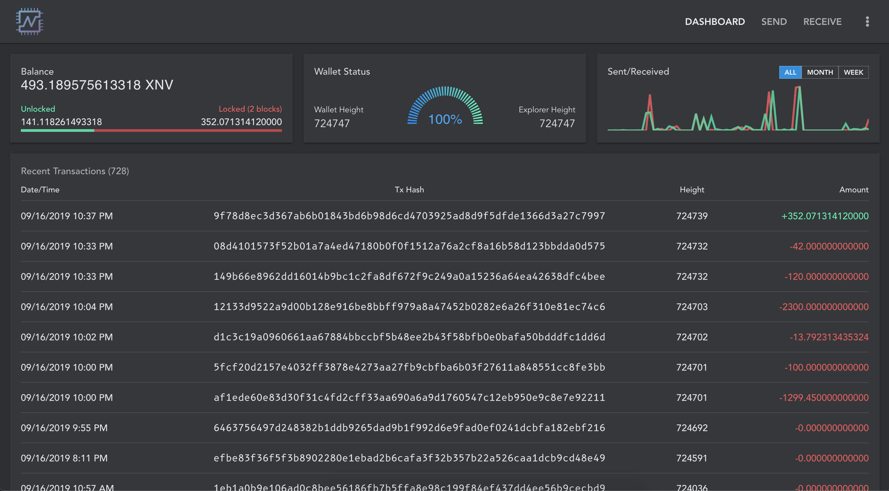

WAZN Web Wallet
======================

[](https://opensource.org/licenses/EUPL-1.2)

## Project setup

#### Install vue-cli dev tools

```bash
npm install vue-cli -g
```

#### Clone the project and install dependencies

```bash
git clone https://github.com/vermin/wazn-webwallet
cd wazn-webwallet
npm install
```

#### Compile with hot-reloading for development

```bash
npm run dev
```

#### Compile and minify for production

```bash
npm run build
```

#### Build with URL path

Set `VUE_PUBLIC_PATH=/<path>/` in `./env.withpath`

```bash
npm run build-with-path
```

#### Hosting

Some specific configuration may be needed depending on your web server.

For nginx
```nginx
location / {
    try_files $uri $uri/ /index.html;
}
```
See the [vue-router history mode docs](https://router.vuejs.org/guide/essentials/history-mode.html#example-server-configurations).

## Connecting to wallet-rpc

```bash
./wazn-wallet-rpc --rpc-bind-port <whatever port you want wallet to listen on> --wallet-dir <wallet directory on disk> --rpc-login wazn:wazn --rpc-access-control-origins <CORS addresses, your web server URL> --rpc-auth-basic --trusted-daemon --log-level 3 --rpc-bind-ip <0.0.0.0 or your IP address> --confirm-external-bind --confirm-cleartext-auth
```


## Feature Backlog
Generate a payment link from the Receive page.  
Reporting tools for transfer list.  
Multi-tenant, hosted wallet service.  
Local, in-browser wallet service.

## Security
**No keys, seeds, or sensitive data is sent to the server**  

## License
```
Licensed under the EUPL-1.2
Copyright (c) 2020 WAZN Project
Copyright (c) 2019 jerme404
```
